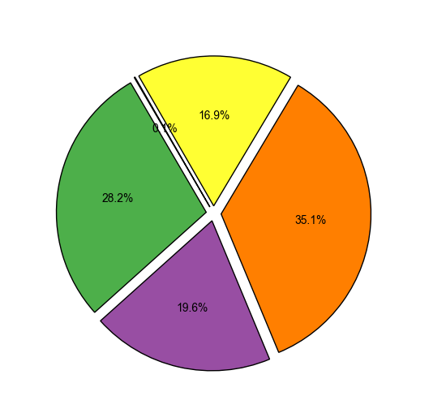

## Hi there 👋

Now I'm building Fullstack Django Python REST API using PostgreSQL. 
I have a background in JavaScript and React Web Development, as well as a social science background.   

## Current Project
- REST API for CL LTD
- TOM App for CL LTD

## Previous Project
- 🔭 BaroQue - Here Is Your Cocktail Bar - an interactive app for cocktail search.
- Live Demo:
[Vercel](https://baroque-here-is-your-cocktail-bar-delta.vercel.app/)

## Favourite Tech  
- Django, Python, JavaScript, React, 
- CSS, Tailwind, Bootstrap, MUI,
- Figma, Adobe PhotoShop, MidJourney, DALL-E. 

<!--## Portfolio 

- My recent portfolio (I didn't update it for ages) is deployed here: 

[Vercel](https://yk-react-portfolio.vercel.app/)

## 📫 How to reach me:
[Linkedin](https://www.linkedin.com/in/yana-kozarenko-237ba5191)   
<!--
**GreenCatInForest/GreenCatInForest** is a ✨ _special_ ✨ repository because its `README.md` (this file) appears on your GitHub profile.

Here are some ideas to get you started:

- 🌱 I’m currently learning ...
- 👯 I’m looking to collaborate on ...
- 🤔 I’m looking for help with ...
- 💬 Ask me about ...
- 📫 How to reach me: ...
- 😄 Pronouns: ...
- ⚡ Fun fact: ...
-->

